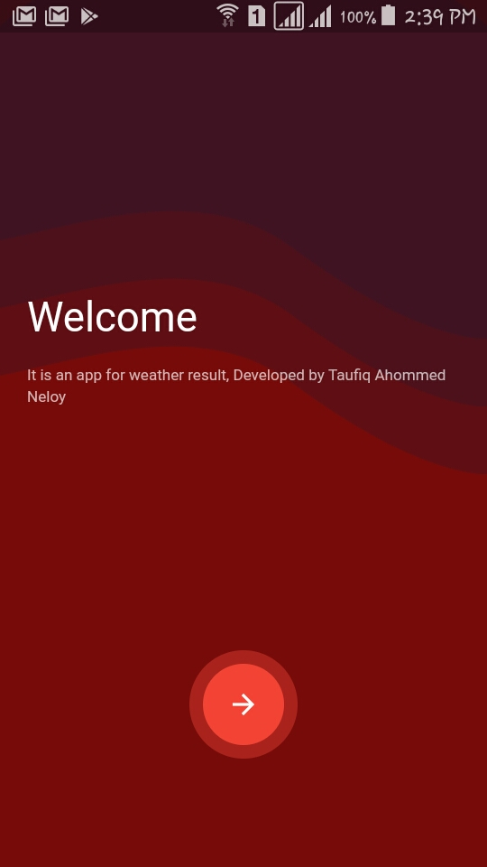
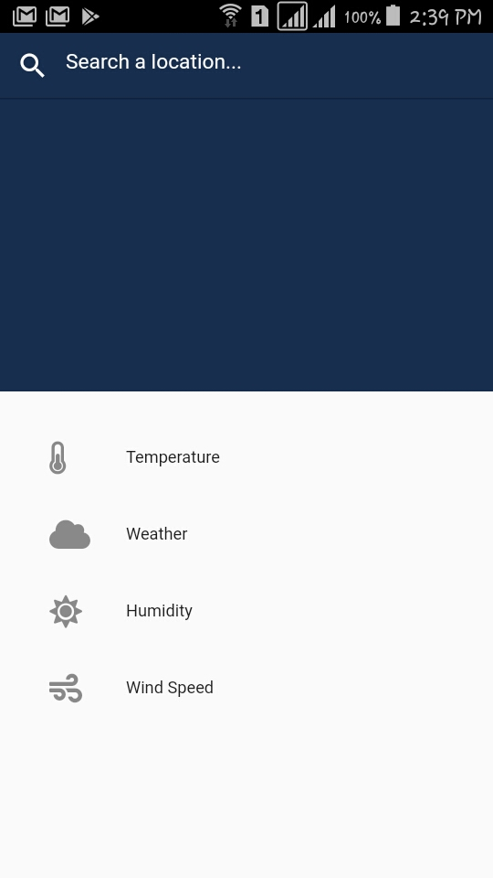
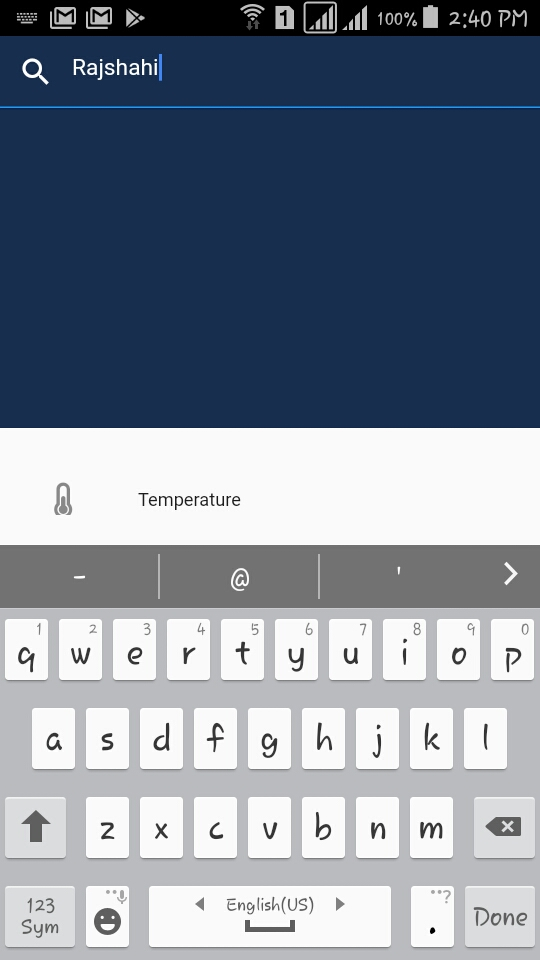
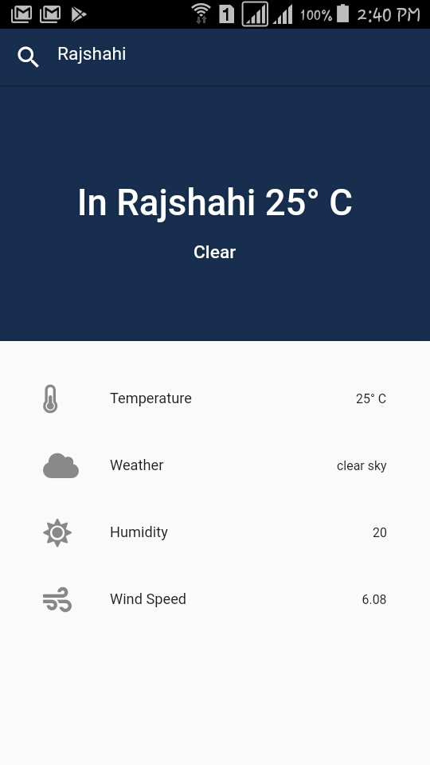

# weatherapp3

This a new flutter application can run in Android and IOS devices. This application can give the weather result by searching a location (city name). Using API. 

## Screenshots: 

